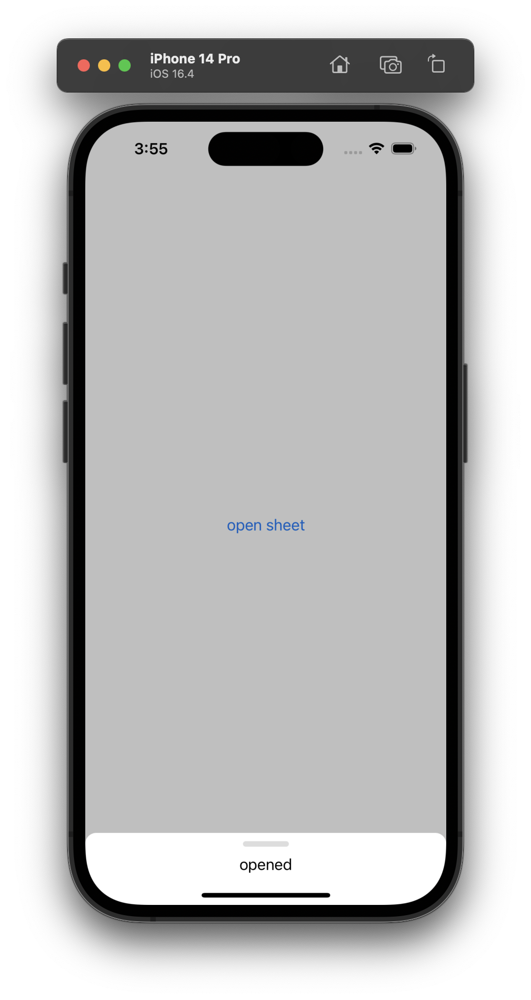
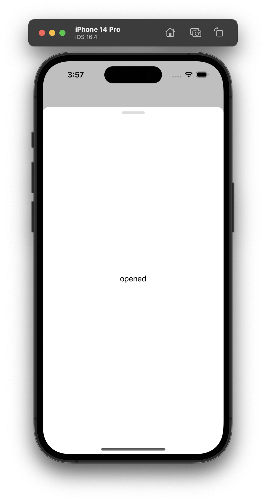
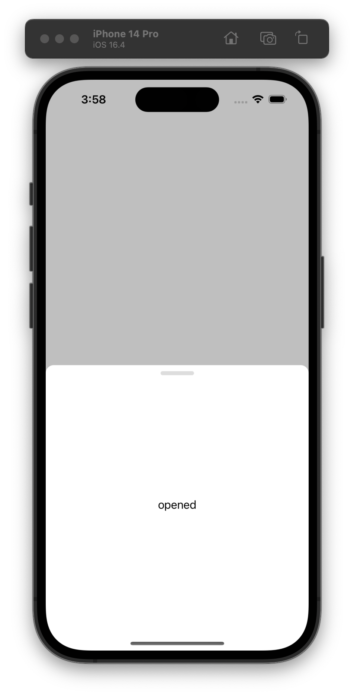
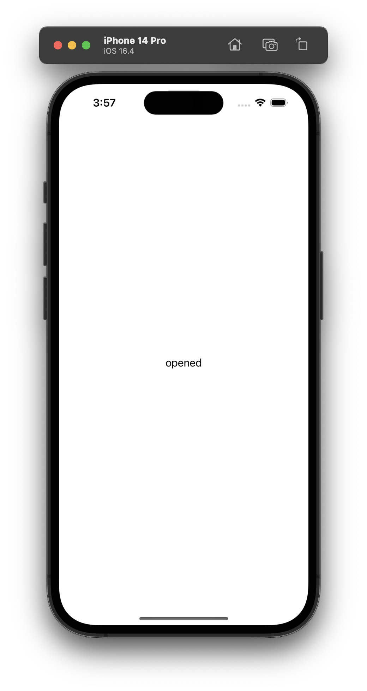
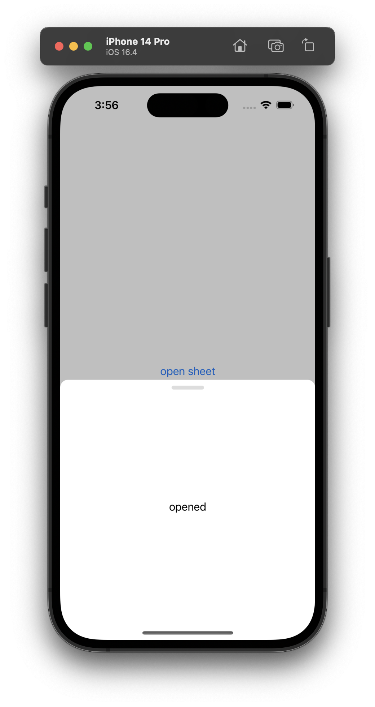

# FittedSheets-SwiftUI

## Requirements


### Abstarct

> Using SwiftUI, I found it difficult to lower the minimum version of iOS, one of which was related to sheet.
> So, I looked for related technologies and worked on the project so that gordontucker's fitted sheets could be used in
> SwiftUI.

## Usage & Example

```swift
struct ContentView: View {
    @State var showFittedSheet: Bool = false
        let sheetConfiguration: SheetConfiguration = SheetConfiguration(sizes: [.intrinsic],
                                                                    options: nil,
                                                                    sheetViewControllerOptinos: [],
                                                                    shouldDismiss: nil,
                                                                    didDismiss: nil)
    
    var body: some View {
        VStack {
            Button {
                showFittedSheet.toggle()
            } label: {
                Text("open sheet")
            }
        }
        .fittedSheet(isPresented: $showFittedSheet,
                     configuration: sheetConfiguration)) {
            Text("opened")
        }
    }
}
```

## SheetConfiguration

### Size

| intrinsic                   | marginFromTop(100)                 | percent(0.5)                 | fullScreen                   | fixed(400)                 |
|-----------------------------|------------------------------------|------------------------------|------------------------------|----------------------------|
|  |  |  |  |  |

### options
[FittedSheets -> SheetOptions](https://github.com/gordontucker/FittedSheets/blob/main/README.md#usage)

### SheetViewControllerOptions
```Swift
public enum SheetViewControllerOptions {
    case gripSize(_ size: CGSize)
    case gripColor(_ color: Color)
    case cornerCurve(_ cornerCurve: CALayerCornerCurve)
    case cornerRadius(_ radius: CGFloat)
    case minimumSpaceAbovePullBar(_ value: CGFloat)
    case pullBarBackgroundColor(_ color: Color)
    case treatPullBarAsClear(_ bool: Bool)
    case dismissOnOverlayTap(_ bool: Bool)
    case dismissOnPull(_ bool: Bool)
    case allowPullingPastMaxHeight(_ bool: Bool)
    case autoAdjustToKeyboard(_ bool: Bool)
    case contentBackgroundColor(color: Color)
    case overlayColor(color: Color)
}
```

### shouldDismiss, didDismiss
((SheetViewController) -> Void)?

---

## Swift Package Manager

- File > Swift Packages > Add Package Dependency
- Add https://github.com/Jeonhui/FitttedSheets-SwiftUI

```asm
https://github.com/Jeonhui/FitttedSheets-SwiftUI
```

## License

FittedSheets-SwiftUI is available under the MIT license. See the [LICENSE](./LICENSE) file for more info.

## Thanks for [gordontucker/FittedSheets](https://github.com/gordontucker/FittedSheets)

- [MIT License](https://github.com/gordontucker/FittedSheets)

