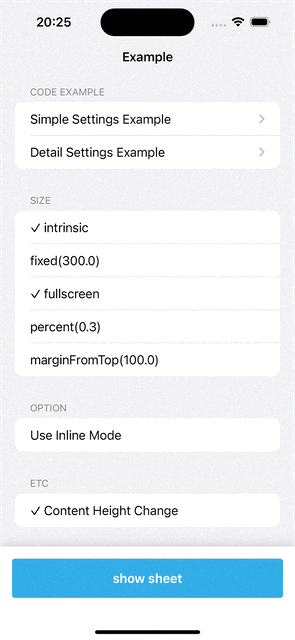
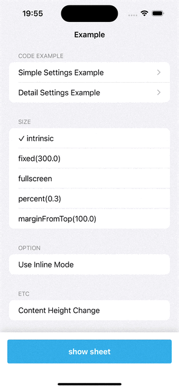
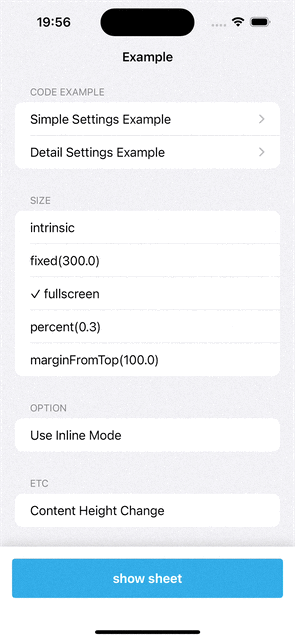
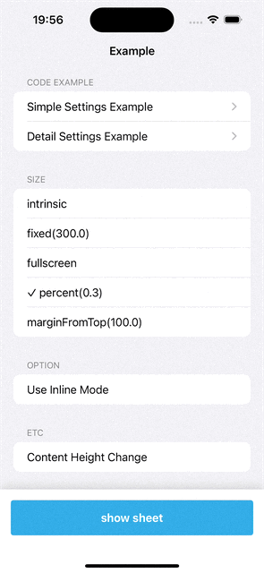
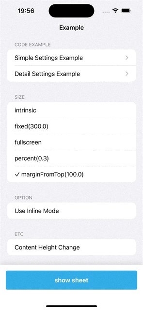
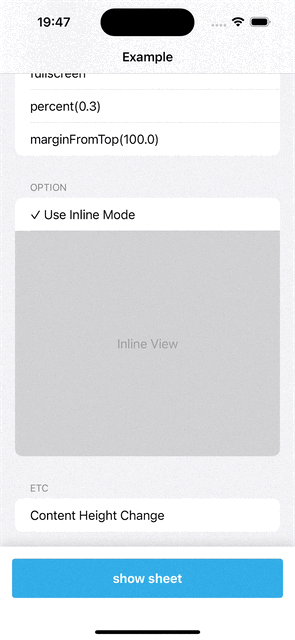

# FittedSheets-SwiftUI


## Overview

### A Sheet Library for SwiftUI

> Using SwiftUI, I found it difficult to lower the minimum version of iOS, one of which was related to sheet.
> So, I looked for related technologies and worked on the project so that gordontucker's fitted sheets could be used in
> SwiftUI. This project makes sheet easier to use in swiftUI.

### Preview



## Installation

### Swift Package Manager

- File > Swift Packages > Add Package Dependency
- Add https://github.com/Jeonhui/FittedSheets-SwiftUI

```asm
https://github.com/Jeonhui/FittedSheets-SwiftUI
```

## Usage & Example

- ### Simple Setting

```swift
struct SimpleSettingExampleView: View {
    // MARK: - Sheet State Variable
    @State var showFittedSheet: Bool = false
    
    var body: some View {
        VStack {
            // MARK: - Show Sheet Action
            Button {
                showFittedSheet.toggle()
            } label: {
                Text("show sheet")
            }
        }
        .navigationTitle("Simple")
        .navigationBarTitleDisplayMode(.inline)
        // MARK: - Append Fitted Sheet
        .fittedSheet(isPresented: $showFittedSheet,
                     sizes: [.intrinsic, .marginFromTop(100)],
                     sheetView: {
            // MARK: - Sheet Content View
            SheetContentView()
        })
    }
}
```

- ### Detail Setting

```swift
struct DetailSettingExampleView: View {
    // MARK: - Sheet State Variable
    @State var showFittedSheet: Bool = false
    
    // MARK: - Configure Detail FittedSheets Settings
    let sheetConfiguration: SheetConfiguration = SheetConfiguration(sizes: [.intrinsic,
                                                                            .marginFromTop(100)],
                                                                    options: .init(pullBarHeight: 40),
                                                                    sheetViewControllerOptinos: [],
                                                                    shouldDismiss: nil,
                                                                    didDismiss: nil)
    var body: some View {
        VStack {
            // MARK: - Show Sheet Action
            Button {
                showFittedSheet.toggle()
            } label: {
                Text("show sheet")
            }
        }
        .navigationTitle("Detail")
        .navigationBarTitleDisplayMode(.inline)
        // MARK: - Append Fitted Sheet
        .fittedSheet(isPresented: $showFittedSheet,
                     configuration: sheetConfiguration) {
            // MARK: - Sheet Content View
            SheetContentView()
        }
    }
}
```

<br/>

## SheetConfiguration

```swift
public struct SheetConfiguration {
    let sizes: [SheetSize] // The sizes of sheet
    let options: SheetOptions? // The options of sheet
    let sheetViewControllerOptions: [SheetViewControllerOptions] // The options of SheetViewController
    let shouldDismiss: ((SheetViewController) -> Void)? // The action when the sheet should dismiss
    let didDismiss: ((SheetViewController) -> Void)? // The action when the sheet did dismiss
}
```

### Size

| intrinsic                                                            | fixed(300)                                                             | fullscreen                                                             | percent(0.3)                                                               | marginFromTop(100)                                                                     |
|----------------------------------------------------------------------|------------------------------------------------------------------------|------------------------------------------------------------------------|----------------------------------------------------------------------------|----------------------------------------------------------------------------------------|
|  |  |  |  |  |

### options

Use [SheetOptions of FittedSheets](https://github.com/gordontucker/FittedSheets/blob/main/README.md#usage).

```swift
public struct SheetOptions {
    // The full height of the pull bar. The presented view controller will treat this area as a safearea inset on the top
    public var pullBarHeight: CGFloat = 24
    
    // The corner radius of the shrunken presenting view controller
    public var presentingViewCornerRadius: CGFloat = 12

    // Extends the background behind the pull bar or not
    public var shouldExtendBackground = true
    
    // Attempts to use intrinsic heights on navigation controllers. This does not work well in combination with keyboards without your code handling it.
    public var setIntrinsicHeightOnNavigationControllers = true
    
    // Pulls the view controller behind the safe area top, especially useful when embedding navigation controllers
    public var useFullScreenMode = true
    
    // Shrinks the presenting view controller, similar to the native modal
    public var shrinkPresentingViewController = true
    
    // Determines if using inline mode or not
    public var useInlineMode = false
    
    // Adds a padding on the left and right of the sheet with this amount. Defaults to zero (no padding)
    public var horizontalPadding: CGFloat = 0
  
    // Sets the maximum width allowed for the sheet. This defaults to nil and doesn't limit the width.
    public var maxWidth: CGFloat?
}


// If nil is specified, the above default value is stored.
public init(pullBarHeight: CGFloat? = nil,
                presentingViewCornerRadius: CGFloat? = nil,
                shouldExtendBackground: Bool? = nil,
                setIntrinsicHeightOnNavigationControllers: Bool? = nil,
                useFullScreenMode: Bool? = nil,
                shrinkPresentingViewController: Bool? = nil,
                useInlineMode: Bool? = nil,
                horizontalPadding: CGFloat? = nil,
                maxWidth: CGFloat? = nil,
                isRubberBandEnabled: Bool? = nil)

```

### SheetViewControllerOptions

```Swift
public enum SheetViewControllerOptions {
    // The size of the grip in the pull bar
    case gripSize(_ size: CGSize) // CGSize (width: 50, height: 6)
    
    // The color of the grip on the pull bar
    case gripColor(_ color: Color) // UIColor(white: 0.868, black: 0.1)
    
    // The corner curve of the sheet
    case cornerCurve(_ cornerCurve: CALayerCornerCurve) // .circular
    
    // The corner radius of the sheet
    case cornerRadius(_ radius: CGFloat) // 12
    
    // minimum distance above the pull bar, prevents bar from coming right up to the edge of the screen
    case minimumSpaceAbovePullBar(_ value: CGFloat) // 0
    
    // Set the pullbar's background explicitly
    case pullBarBackgroundColor(_ color: Color) // UIColor.clear
    
    // Determine if the rounding should happen on the pullbar or the presented controller only (should only be true when the pull bar's background color is .clear)
    case treatPullBarAsClear(_ bool: Bool) // false
    
    // Disable the dismiss on background tap functionality
    case dismissOnOverlayTap(_ bool: Bool) // 0
    
    // Disable the ability to pull down to dismiss the modal
    case dismissOnPull(_ bool: Bool)  //  true
    
    // Allow pulling past the maximum height and bounce back. 
    case allowPullingPastMaxHeight(_ bool: Bool) // true
    
    // Automatically grow/move the sheet to accomidate the keyboard.
    case autoAdjustToKeyboard(_ bool: Bool) // true
    
    // Color of the sheet anywhere the child view controller may not show (or is transparent), such as behind the keyboard currently
    case contentBackgroundColor(color: Color)
    
    // Change the overlay color
    case overlayColor(color: Color) // UIColor(white: 0, alpha: 0.25)
}
```

| **useInlineMode**                                                              |
|--------------------------------------------------------------------------------|   
|  |  

---

## License

FittedSheets-SwiftUI is available under the MIT license. See the [LICENSE](./LICENSE) file for more info.

## Thanks for [gordontucker/FittedSheets](https://github.com/gordontucker/FittedSheets)

- [MIT License](https://github.com/gordontucker/FittedSheets)

